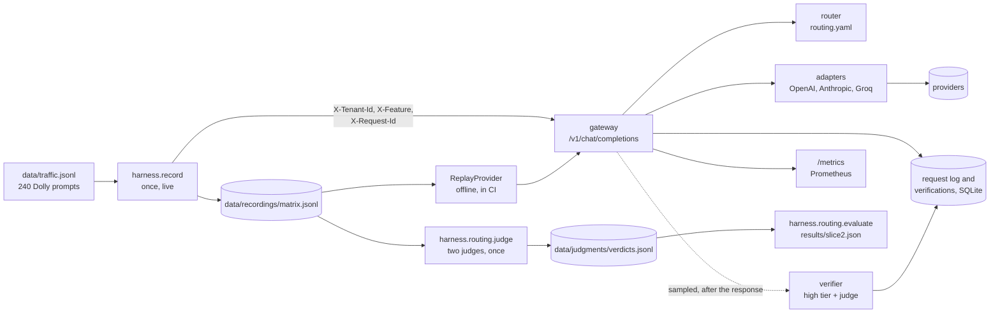

# llm-gateway

An OpenAI-compatible gateway in front of OpenAI, Anthropic and Groq that routes each request by cost and attributes it to a tenant and a feature. On 238 replayed prompts, **sending every request to the cheapest model kept 95.8% of answers acceptable to two judges at 95.6% less cost than the reference model**, passing a pre-registered quality bar; the learned classifier the plan called for passed too, but saved only 61.6%. The project's live calls cost US$ 3.78 in total.

[Versão em português](README.pt-br.md)

## Result

Two slices of four are done. Every number below is recomputed offline from committed recordings, and CI fails if a published number goes stale.

### Slice 2: routing by cost, verified by judges

Each candidate answer was graded against the reference answer (gpt-6.1-sol) by two judges from two providers, gpt-4.1-mini and claude-sonnet-5-5; it counts as acceptable only when both accept it. An answer cut by the output limit or empty fails by rule, on every tier. Learned policies were scored out of fold, 5 folds stratified by request class. The policies, the threshold, the quality bar (lower end of the 95% interval at least 90%) and the comparisons were fixed in [harness/routing/prereg.py](harness/routing/prereg.py) before any verdict existed.

| policy | acceptable answers (95% CI) | cost per 1,000 requests, US$ | cost reduction vs always_high | low / medium / high | meets bar |
|---|---|---|---|---|---|
| always_high (gpt-6.1-sol) | 99.6% [98.7, 100.0] | 2.046 | 0% | 0 / 0 / 100% | yes |
| **always_low (gpt-6-luna)** | **95.8% [93.3, 98.3]** | **0.089** | **95.6%** | 100 / 0 / 0% | yes |
| always_medium (claude-haiku-4-5) | 85.7% [81.1, 89.9] | 1.104 | 46.1% | 0 / 100 / 0% | no |
| feature_table | 95.4% [92.4, 97.9] | 0.566 | 72.3% | 75 / 13 / 12% | yes |
| classifier (pre-registered primary) | 95.8% [93.3, 98.3] | 0.786 | 61.6% | 67 / 0 / 33% | yes |
| oracle (perfect routing, a ceiling) | 99.6% [98.7, 100.0] | 0.190 | 90.7% | 96 / 3 / 2% | yes |

What it shows:

- **The simplest policy won.** The classifier met the bar, as pre-registered, but always_low reached the same acceptance at about a ninth of its cost. The classifier sent a third of the traffic to the expensive model and gained no acceptable answer for it. Against the feature table, the pre-registered McNemar test found 1 prompt in favour of the classifier and 0 against (p = 1.0), and the classifier cost US$ 0.22 more per 1,000 requests.
- **There is room for a router, and cheap features do not find it.** The oracle reaches 99.6% while sending only 2% of requests to the expensive model. Prompt length, a context block, a few instruction keywords and the request class do not predict which 4% of requests gpt-6-luna fails.
- **The medium tier was worse than the low one.** claude-haiku-4-5 costs twelve times what gpt-6-luna does and was accepted on 85.7% of prompts against 95.8%. Price order is not quality order.
- **The judges agree on 93.2% of 474 pairs** (Cohen's kappa 0.36); Sonnet is the stricter one. A blind human grader and the judge consensus agree on 27 of 30 sampled answers. The 3 disagreements are answers the human accepted and the judges rejected for a named factual error (two instruments classified the wrong way round, Melbourne listed on the east coast, a hard size threshold for round planets). The human accepted all 30, so kappa is 0 by construction and the raw count is the informative number.

The gateway serves `always_low` from [llm_gateway/routing.yaml](llm_gateway/routing.yaml), read again whenever it changes. A sampled verifier watches that choice after the response is sent: it asks the high tier the same request, has gpt-4.1-mini judge the routed answer, and records every verdict within a daily cap. From the recorded verdicts ([results/slice2_verifier.md](results/slice2_verifier.md)):

| sample rate | overhead per 1,000 requests, US$ | overhead vs serving cost | total cost reduction vs always_high | failures caught per 1,000 |
|---|---|---|---|---|
| 1% | 0.023 | 26% | 94.5% | 0.3 |
| 5% (configured) | 0.116 | 131% | 90.0% | 1.5 |
| 10% | 0.233 | 261% | 84.3% | 2.9 |

One verification costs about 26 times what serving the request cost, because it goes to the model always_low avoids. The verifier is a monitoring instrument: it measures the failure rate and collects routing failures as training examples (with prompt features, never prompt text); it does not fix the answer a user already has. Its single judge flags 7 of the 10 failures the two-judge consensus finds.

Full tables, including acceptance by request class: [results/slice2.md](results/slice2.md).

### Slice 1: the spine

Each of 240 prompts was sent once to each of six models and recorded, for US$ 1.92.

| model | tier | cost per 1,000 requests, US$ (95% CI) | mean output tokens | cut at 1,024 tokens | p50 latency, s | p95 latency, s |
|---|---|---|---|---|---|---|
| gpt-6.1-sol | high | 2.12 [1.88, 2.36] | 185 | 3 of 240 | 4.7 | 16.5 |
| claude-sonnet-5-5 | high | 4.21 [3.85, 4.57] | 381 | 7 of 240 | 3.4 | 10.1 |
| claude-haiku-4-5 | medium | 1.13 [1.05, 1.21] | 197 | 0 of 240 | 2.3 | 4.7 |
| gpt-oss-120b (Groq) | medium | 0.32 [0.29, 0.35] | 483 | 62 of 240 | 1.3 | 2.9 |
| gpt-6-luna | low | 0.09 [0.08, 0.10] | 158 | 2 of 240 | 2.3 | 6.1 |
| gpt-oss-20b (Groq) | low | 0.12 [0.11, 0.13] | 357 | 18 of 240 | 0.6 | 1.7 |

- **Price per token is not cost per request.** gpt-6.1-sol and claude-sonnet-5-5 have the same list price, but Sonnet costs twice as much per request: about twice the output tokens (381 against 185), and the same prompts count as about 50% more input tokens on Anthropic's side (202 against 133).
- **The output cap fails models in two ways.** gpt-oss-120b was cut on 62 of 240 answers because it writes long answers, often tables. The 5 cut answers from the GPT-6 models are empty: reasoning used the whole budget, and the call was billed in full.
- **Every request is attributed.** All 1,440 replayed requests were logged with tenant, feature and request id, and the cost attributed per tenant sums to the spend ledger.
- **The gateway adds 0.4 ms (p50) and 0.6 ms (p95)** in process, provider time excluded.

Details: [results/slice1.md](results/slice1.md). Latency is what one machine saw on 2026-10-07, one call at a time, network included.

| slice | what it adds | status |
|---|---|---|
| 1 | spine: API, registry, metadata, log, metrics, record and replay | done |
| 2 | cost routing: tier map in YAML, judged quality, pre-registered policy comparison, sampled verifier | done |
| 3 | reliability: per-provider health, circuit breaker, failover, retry queue, chaos test | next |
| 4 | cache: exact and semantic, versioned key, wrong-answer rate under 1% | planned |

No production system sends traffic to this gateway. The traffic is a public dataset, replayed.

## Data path



Live model calls happen once: the recording, then the judges. Everything after that, including the published numbers and the CI checks, reads the committed recordings.

## Design decisions

**Record once, replay offline.** The 1,440 recorded answers and 948 verdicts are committed. Routing policies are scored by looking up recorded answers, and CI regenerates every published JSON and fails when it differs from the committed file. What I gave up: latency is a single snapshot, from one machine on one day.

**Labels from judged outcomes, under a pre-registered design.** The cost-routing guide this follows asks for 200 hand-labelled prompts. Instead, each prompt's label is whether each tier's answer was acceptable, which is what a router needs, graded by two judges from two providers, neither of them a candidate. The design was committed before any verdict existed, and a blind human check of 30 answers was committed before the full judge run. What I gave up: the labels are as good as the judges; the human check could confirm their acceptances but, having accepted everything, could not test their rejections.

**Own adapters on the official SDKs, not LiteLLM.** Three providers need only two API shapes, because Groq speaks the OpenAI one. Owning the adapters means owning the error taxonomy that slice 3's health tracking counts, and switching SDK retries off, since a retry hidden in the SDK inflates latency and hides failures. What I gave up: a fourth provider is new code, and the gateway forwards neither streaming nor tools. On "why not LiteLLM Proxy": the Proxy gives the mechanism; this project is about the evidence around it, and the record, replay and judge harness would point at the Proxy just as well.

**A budget the code enforces.** The whole project has US$ 10. Before a paid run starts, the ledger total plus the run's worst case must stay under it; the gateway's verifier applies the same rule to its daily cap. The worst case is bounded by the output limit and the prompt's UTF-8 bytes (doubled for Anthropic, whose tokenizer is not documented). What I gave up: the bound is loose, four times the actual cost of the recording, so both judges could not run in one go and ran one after the other.

## What did not work

- **The learned router.** The pre-registered classifier met the quality bar and was still the wrong choice: always_low matched its acceptance at about a ninth of its cost. The cheap prompt features it used did not predict where gpt-6-luna fails.
- **The medium tier.** claude-haiku-4-5 was supposed to sit between the cheap and the expensive model; it cost twelve times the cheap one and was accepted less often.
- **Two prompts with no reference.** On two creative-writing prompts both high-tier models failed (one empty, one cut), while the cheap models finished. With no reference answer to judge against, they were excluded, leaving 238.
- **The human check.** I accepted all 30 answers I graded, including three with factual errors the judges named. That makes kappa 0 and shows the check's limit.
- **Two claims I almost published.** A draft of the verifier report said two-judge verification would cost twenty times more (measured: 2.4 times) and that the single judge raised no false alarms (true by construction, so uninformative). Both were corrected before the commit.
- From slice 1: the first traffic source (69 legal questions of one class) was replaced by Dolly; Llama 3.1 8B on Groq was no longer self-serve; my recording estimate was twice the real cost; the 1,024-token cap cut 92 of 1,440 answers.

## Setup

Requires [uv](https://docs.astral.sh/uv/). Python 3.12 is pinned.

```bash
uv sync
uv run pytest                              # offline; also regenerates the published numbers and compares them
uv run python -m harness.report            # results/slice1.md from the recording, offline
uv run python -m harness.routing.evaluate  # results/slice2.md from the recording and the verdicts, offline
```

To serve the gateway or make new calls, copy `.env.example` to `.env` and set `OPENAI_API_KEY`, `ANTHROPIC_API_KEY` and `GROQ_API_KEY`.

```bash
uv run --env-file .env uvicorn llm_gateway.main:app --port 8000
curl http://localhost:8000/v1/chat/completions \
  -H "Content-Type: application/json" \
  -H "X-Tenant-Id: tenant-a" -H "X-Feature: open_qa" -H "X-Request-Id: demo-1" \
  -d '{"model": "auto", "messages": [{"role": "user", "content": "Name a river."}]}'
uv run --env-file .env python -m harness.record --dry-run   # plan and worst-case cost, no calls
```

A request without the three headers is refused with 400. `"model": "auto"` routes by `routing.yaml` and the response's `gateway.routing` says which tier and why; a named model bypasses the router. `GET /v1/models` lists the registry with prices, and `GET /metrics` serves Prometheus metrics.

The prompts in `data/traffic.jsonl` derive from databricks-dolly-15k and are under CC BY-SA 3.0; see [data/README.md](data/README.md).
