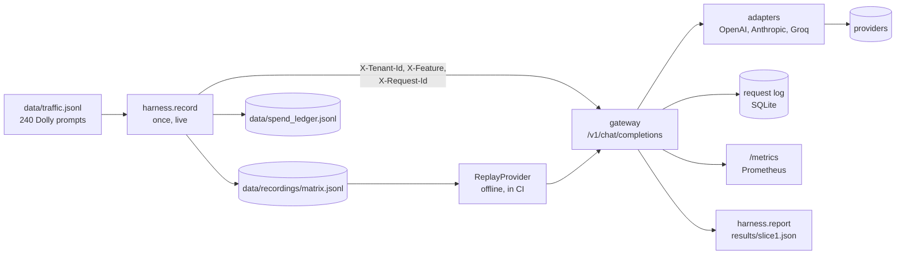

# llm-gateway

An OpenAI-compatible gateway in front of OpenAI, Anthropic and Groq that attributes every call to a tenant and a feature. Replaying 240 recorded prompts through it, the same traffic costs **US$ 0.09 per 1,000 requests on the cheapest model and US$ 4.21 on the most expensive, a 46x spread**, measured offline from one live recording that cost US$ 1.92.

[Versão em português](README.pt-br.md)

## Result

Slice 1 of 4: the spine (OpenAI-shaped API, priced model registry, mandatory metadata, request log, metrics). Each of the 240 prompts was sent once to each of six models and recorded; every number below is recomputed offline from that recording, and CI fails if a published number goes stale.

| model | tier | cost per 1,000 requests, US$ (95% CI) | mean output tokens | cut at 1,024 tokens | p50 latency, s | p95 latency, s |
|---|---|---|---|---|---|---|
| gpt-6.1-sol | high | 2.12 [1.88, 2.36] | 185 | 3 of 240 | 4.7 | 16.5 |
| claude-sonnet-5-5 | high | 4.21 [3.85, 4.57] | 381 | 7 of 240 | 3.4 | 10.1 |
| claude-haiku-4-5 | medium | 1.13 [1.05, 1.21] | 197 | 0 of 240 | 2.3 | 4.7 |
| gpt-oss-120b (Groq) | medium | 0.32 [0.29, 0.35] | 483 | 62 of 240 | 1.3 | 2.9 |
| gpt-6-luna | low | 0.09 [0.08, 0.10] | 158 | 2 of 240 | 2.3 | 6.1 |
| gpt-oss-20b (Groq) | low | 0.12 [0.11, 0.13] | 357 | 18 of 240 | 0.6 | 1.7 |

What the table shows:

- **Price per token is not cost per request.** gpt-6.1-sol and claude-sonnet-5-5 have the same list price (US$ 2 in, US$ 10 out per million tokens), but Sonnet costs twice as much per request: it writes about twice the output tokens (381 against 185), and the same prompts count as about 50% more input tokens on Anthropic's side (202 against 133).
- **The output cap fails models in two different ways.** gpt-oss-120b was cut on 62 of 240 answers (22 of the 30 `general_qa` prompts) because it writes long answers, often tables. The 5 cut answers from the GPT-6 models are empty: reasoning used the whole 1,024-token budget, and the call was billed in full.
- **Every request is attributed.** All 1,440 replayed requests were logged with tenant, feature and request id, and the cost the gateway attributed per tenant sums to the US$ 1.92 in the spend ledger.
- **The gateway adds 0.4 ms (p50) and 0.6 ms (p95)** in process, provider time excluded.

Cost by request class, intervals and cut answers by class are in [results/slice1.md](results/slice1.md). Latency is what one machine saw on 2026-10-07, calling one model at a time; it includes the network.

Whether the cheap answers are good enough is slice 2's question.

| slice | what it adds | status |
|---|---|---|
| 1 | spine: API, registry, metadata, log, metrics, record and replay | done |
| 2 | cost routing: complexity tiers, YAML tier map, judge-verified quality parity | next |
| 3 | reliability: per-provider health, circuit breaker, failover, retry queue, chaos test | planned |
| 4 | cache: exact and semantic, versioned key, wrong-answer rate under 1% | planned |

No production system sends traffic to this gateway. The traffic is a public dataset, replayed.

## Data path



Live calls happen once, in `harness.record`. Everything after that, including the published numbers and the CI check, replays the recording through the same gateway code with a provider that answers from disk and refuses a call it has no recording for.

## Design decisions

**Record once, replay offline.** The 1,440 recorded answers cost US$ 1.92 and are committed. Every later experiment (routing policies, the judge, the cache) reads them instead of calling a model, and CI regenerates `results/slice1.json` and fails when it differs from the committed file. What I gave up: latency is a single snapshot, from one machine on one day, so it says which model was slower that afternoon, not how a provider behaves over a week.

**Own adapters on the official SDKs, not LiteLLM.** Three providers need only two API shapes, because Groq speaks the OpenAI one. Owning the adapters means owning the error taxonomy (rate limit, timeout, connection, server error, auth, bad request) that slice 3's health tracking counts, and switching SDK retries off: a retry hidden inside the SDK would inflate latency and hide failures from the gateway. What I gave up: a fourth provider is new code, and the gateway forwards neither streaming nor tools. On "why not LiteLLM Proxy": the Proxy gives the mechanism (fallbacks, caching, budgets); this project is about the evidence around it, and the record, replay and judge harness would point at the Proxy just as well.

**A budget the code enforces.** The whole project has US$ 10. Before any paid run starts, the ledger total plus the run's worst case must stay under it. The worst case is bounded, not estimated: output by the 1,024-token cap the run sends, input by the UTF-8 byte count of the prompts (doubled for Anthropic, whose tokenizer is not documented). What I gave up: the bound is loose. For the full recording it was US$ 7.38 against US$ 1.84 actually spent, so the check refuses runs that would have fit. And the cap cuts verbose answers, 92 of 1,440.

## What did not work

- **The first traffic source.** I planned to replay questions from my own RAG evaluation. They turned out to be 69 unique questions of a single request class (legal Q&A over retrieved context, in Portuguese), which cannot show differences between request classes. I replaced them with 240 prompts from databricks-dolly-15k, 30 from each of its eight categories.
- **The planned cheap tier.** Llama 3.1 8B on Groq was the plan; on 2026-10-07 it was listed as Enterprise only. Running it locally with Ollama would have measured my laptop's CPU, not a served model. gpt-oss-20b on Groq took its place.
- **My cost estimate.** I estimated US$ 3.96 for the recording, assuming 500 reasoning tokens per answer. It cost US$ 1.92, smoke included.
- **The 1,024-token output cap,** set to keep the budget bound. It cut 26% of gpt-oss-120b's answers and left five GPT-6 answers empty after reasoning used the whole budget. I kept the cap and report it: in slice 2 a cut answer counts as a failure of that model under this policy.
- **One timeout.** One gpt-6-luna call timed out at 60 s during the recording and was re-run.

## Setup

Requires [uv](https://docs.astral.sh/uv/). Python 3.12 is pinned.

```bash
uv sync
uv run pytest                        # offline; also regenerates the published numbers and compares them
uv run python -m harness.report      # rewrite results/slice1.md from the recording, offline
```

To serve the gateway or record new calls, copy `.env.example` to `.env` and set `OPENAI_API_KEY`, `ANTHROPIC_API_KEY` and `GROQ_API_KEY`.

```bash
uv run --env-file .env uvicorn llm_gateway.main:app --port 8000
curl http://localhost:8000/v1/chat/completions \
  -H "Content-Type: application/json" \
  -H "X-Tenant-Id: tenant-a" -H "X-Feature: open_qa" -H "X-Request-Id: demo-1" \
  -d '{"model": "gpt-6-luna", "messages": [{"role": "user", "content": "Name a river."}]}'
uv run --env-file .env python -m harness.record --dry-run   # plan and worst-case cost, no calls
```

A request without the three headers is refused with 400. `GET /v1/models` lists the registry with prices, and `GET /metrics` serves Prometheus metrics.

The prompts in `data/traffic.jsonl` derive from databricks-dolly-15k and are under CC BY-SA 3.0; see [data/README.md](data/README.md).
