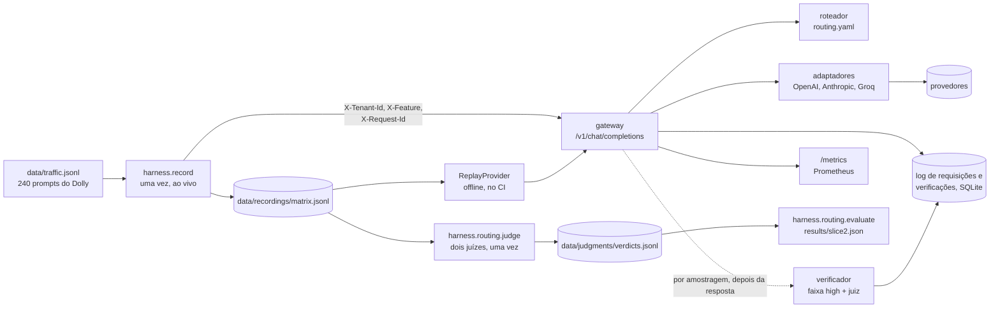

# llm-gateway

Um gateway compatível com a API da OpenAI, na frente de OpenAI, Anthropic e Groq, que roteia cada requisição pelo custo e a atribui a um tenant e a uma feature. Em 238 prompts reproduzidos, **mandar toda requisição para o modelo mais barato manteve 95,8% das respostas aceitáveis para dois juízes, com 95,6% menos custo que o modelo de referência**, passando numa barra de qualidade pré-registrada; o classificador aprendido que o plano pedia também passou, mas economizou só 61,6%. As chamadas ao vivo do projeto custaram US$ 3,78 no total.

[English version](README.md)

## Resultado

Duas das quatro fatias estão prontas. Todos os números abaixo são recalculados offline a partir de gravações commitadas, e o CI falha se um número publicado ficar desatualizado.

### Fatia 2: roteamento por custo, verificado por juízes

Cada resposta candidata foi avaliada contra a resposta de referência (gpt-6.1-sol) por dois juízes de dois provedores, gpt-4.1-mini e claude-sonnet-5-5; ela só conta como aceitável quando os dois aceitam. Uma resposta cortada pelo limite de saída ou vazia falha por regra, em todas as faixas. As políticas aprendidas foram avaliadas fora da amostra de treino, com validação cruzada em 5 partes estratificadas por classe de requisição. As políticas, o limiar, a barra de qualidade (limite inferior do intervalo de 95% de pelo menos 90%) e as comparações foram fixados em [harness/routing/prereg.py](harness/routing/prereg.py) antes de existir qualquer veredito.

| política | respostas aceitáveis (IC 95%) | custo por 1.000 requisições, US$ | redução de custo vs always_high | low / medium / high | passa na barra |
|---|---|---|---|---|---|
| always_high (gpt-6.1-sol) | 99,6% [98,7; 100,0] | 2,046 | 0% | 0 / 0 / 100% | sim |
| **always_low (gpt-6-luna)** | **95,8% [93,3; 98,3]** | **0,089** | **95,6%** | 100 / 0 / 0% | sim |
| always_medium (claude-haiku-4-5) | 85,7% [81,1; 89,9] | 1,104 | 46,1% | 0 / 100 / 0% | não |
| feature_table | 95,4% [92,4; 97,9] | 0,566 | 72,3% | 75 / 13 / 12% | sim |
| classifier (principal, pré-registrada) | 95,8% [93,3; 98,3] | 0,786 | 61,6% | 67 / 0 / 33% | sim |
| oracle (roteamento perfeito, um teto) | 99,6% [98,7; 100,0] | 0,190 | 90,7% | 96 / 3 / 2% | sim |

O que a tabela mostra:

- **A política mais simples venceu.** O classificador passou na barra, como pré-registrado, mas o always_low chegou à mesma taxa de aceite por cerca de um nono do custo. O classificador mandou um terço do tráfego para o modelo caro e não ganhou nenhuma resposta aceitável com isso. Contra a tabela por feature, o teste de McNemar pré-registrado achou 1 prompt a favor do classificador e 0 contra (p = 1,0), e o classificador custou US$ 0,22 a mais por 1.000 requisições.
- **Há espaço para um roteador, e as características baratas não o encontram.** O oráculo chega a 99,6% mandando só 2% das requisições para o modelo caro. Tamanho do prompt, presença de contexto, algumas palavras-chave da instrução e a classe de requisição não preveem em quais 4% das requisições o gpt-6-luna falha.
- **A faixa medium foi pior que a low.** O claude-haiku-4-5 custa doze vezes o gpt-6-luna e foi aceito em 85,7% dos prompts, contra 95,8%. Ordem de preço não é ordem de qualidade.
- **Os juízes concordam em 93,2% dos 474 pares** (kappa de Cohen 0,36); o Sonnet é o mais rigoroso. Um avaliador humano às cegas e o consenso dos juízes concordam em 27 de 30 respostas sorteadas. As 3 divergências são respostas que o humano aceitou e os juízes recusaram por um erro factual nomeado (dois instrumentos classificados ao contrário, Melbourne listada na costa leste, um limite rígido de tamanho para planetas redondos). O humano aceitou as 30, então o kappa é 0 por construção e a contagem bruta é o número informativo.

O gateway serve o `always_low` a partir do [llm_gateway/routing.yaml](llm_gateway/routing.yaml), relido sempre que muda. Um verificador por amostragem acompanha essa escolha depois que a resposta é enviada: ele faz a mesma pergunta à faixa high, pede ao gpt-4.1-mini que julgue a resposta roteada e registra cada veredito, dentro de um teto diário de gasto. A partir dos vereditos gravados ([results/slice2_verifier.md](results/slice2_verifier.md)):

| taxa de amostragem | acréscimo por 1.000 requisições, US$ | acréscimo vs custo de servir | redução total vs always_high | falhas pegas por 1.000 |
|---|---|---|---|---|
| 1% | 0,023 | 26% | 94,5% | 0,3 |
| 5% (configurada) | 0,116 | 131% | 90,0% | 1,5 |
| 10% | 0,233 | 261% | 84,3% | 2,9 |

Uma verificação custa cerca de 26 vezes o que custou servir a requisição, porque vai para o modelo que o always_low evita. O verificador é um instrumento de monitoramento: mede a taxa de falha e junta falhas de roteamento como exemplos de treino (com as características do prompt, nunca o texto); ele não conserta a resposta que o usuário já recebeu. Com um juiz só, ele marca 7 das 10 falhas que o consenso dos dois juízes encontra.

Tabelas completas, incluindo o aceite por classe de requisição: [results/slice2.md](results/slice2.md).

### Fatia 1: a espinha

Cada um dos 240 prompts foi enviado uma vez a cada um dos seis modelos e gravado, por US$ 1,92.

| modelo | faixa | custo por 1.000 requisições, US$ (IC 95%) | média de tokens de saída | cortadas em 1.024 tokens | latência p50, s | latência p95, s |
|---|---|---|---|---|---|---|
| gpt-6.1-sol | high | 2,12 [1,88; 2,36] | 185 | 3 de 240 | 4,7 | 16,5 |
| claude-sonnet-5-5 | high | 4,21 [3,85; 4,57] | 381 | 7 de 240 | 3,4 | 10,1 |
| claude-haiku-4-5 | medium | 1,13 [1,05; 1,21] | 197 | 0 de 240 | 2,3 | 4,7 |
| gpt-oss-120b (Groq) | medium | 0,32 [0,29; 0,35] | 483 | 62 de 240 | 1,3 | 2,9 |
| gpt-6-luna | low | 0,09 [0,08; 0,10] | 158 | 2 de 240 | 2,3 | 6,1 |
| gpt-oss-20b (Groq) | low | 0,12 [0,11; 0,13] | 357 | 18 de 240 | 0,6 | 1,7 |

- **Preço por token não é custo por requisição.** O gpt-6.1-sol e o claude-sonnet-5-5 têm o mesmo preço de tabela, mas o Sonnet custa o dobro por requisição: cerca do dobro de tokens de saída (381 contra 185), e os mesmos prompts contam cerca de 50% mais tokens de entrada do lado da Anthropic (202 contra 133).
- **O limite de saída derruba modelos de dois jeitos.** O gpt-oss-120b foi cortado em 62 de 240 respostas porque escreve respostas longas, muitas vezes com tabelas. As 5 respostas cortadas dos modelos GPT-6 vieram vazias: o raciocínio consumiu o limite inteiro, e a chamada foi cobrada mesmo assim.
- **Toda requisição é atribuída.** As 1.440 requisições reproduzidas foram registradas com tenant, feature e request id, e o custo atribuído por tenant soma o registro de gastos.
- **O gateway acrescenta 0,4 ms (p50) e 0,6 ms (p95)** dentro do processo, sem contar o tempo do provedor.

Detalhes: [results/slice1.md](results/slice1.md). A latência é o que uma máquina viu em 2026-10-07, uma chamada por vez, com a rede incluída.

| fatia | o que acrescenta | estado |
|---|---|---|
| 1 | espinha: API, registro, metadados, log, métricas, gravação e replay | pronta |
| 2 | roteamento por custo: mapa de faixas em YAML, qualidade julgada, comparação pré-registrada de políticas, verificador por amostragem | pronta |
| 3 | confiabilidade: saúde por provedor, circuit breaker, failover, fila com retry, teste de caos | próxima |
| 4 | cache: exato e semântico, chave versionada, taxa de resposta errada abaixo de 1% | planejada |

Nenhum sistema em produção manda tráfego para este gateway. O tráfego é um dataset público, reproduzido.

## Caminho dos dados



As chamadas ao vivo acontecem uma vez: a gravação e depois os juízes. Tudo o que vem depois, incluindo os números publicados e as checagens do CI, lê as gravações commitadas.

## Decisões de design

**Gravar uma vez, reproduzir offline.** As 1.440 respostas gravadas e os 948 vereditos estão commitados. As políticas de roteamento são avaliadas consultando as respostas gravadas, e o CI regenera cada JSON publicado e falha quando ele difere do arquivo commitado. Do que abri mão: a latência é um retrato único, de uma máquina num dia.

**Rótulos vindos do resultado julgado, sob um desenho pré-registrado.** O guia de roteamento por custo que este projeto segue pede 200 prompts rotulados à mão. Em vez disso, o rótulo de cada prompt é se a resposta de cada faixa foi aceitável, que é o que um roteador precisa saber, julgado por dois juízes de dois provedores, nenhum deles candidato. O desenho foi commitado antes de existir qualquer veredito, e uma checagem humana às cegas de 30 respostas foi commitada antes da execução completa dos juízes. Do que abri mão: os rótulos são tão bons quanto os juízes; a checagem humana pôde confirmar os aceites deles, mas, tendo aceitado tudo, não pôde testar as recusas.

**Adaptadores próprios sobre os SDKs oficiais, sem o LiteLLM.** Três provedores precisam de só dois formatos de API, porque o Groq fala o da OpenAI. Ter os adaptadores significa ter a taxonomia de erros que o acompanhamento de saúde da fatia 3 conta, e poder desligar as retentativas dos SDKs, já que uma retentativa escondida no SDK aumenta a latência e esconde falhas. Do que abri mão: um quarto provedor é código novo, e o gateway não repassa streaming nem tools. Sobre "por que não o LiteLLM Proxy": o Proxy entrega o mecanismo; este projeto é sobre a evidência em volta dele, e o harness de gravação, replay e juiz apontaria para o Proxy do mesmo jeito.

**Um orçamento que o código impõe.** O projeto inteiro tem US$ 10. Antes de uma execução paga começar, o total do registro de gastos mais o pior caso da execução precisa ficar abaixo disso; o verificador do gateway aplica a mesma regra ao teto diário. O pior caso é limitado pelo teto de saída e pelos bytes UTF-8 do prompt (o dobro para a Anthropic, que não documenta seu tokenizador). Do que abri mão: o limite é folgado, quatro vezes o custo real da gravação, então os dois juízes não puderam rodar de uma vez e rodaram um depois do outro.

## O que não funcionou

- **O roteador aprendido.** O classificador pré-registrado passou na barra de qualidade e ainda assim foi a escolha errada: o always_low igualou o aceite dele por cerca de um nono do custo. As características baratas do prompt que ele usou não previram onde o gpt-6-luna falha.
- **A faixa medium.** O claude-haiku-4-5 deveria ficar entre o modelo barato e o caro; custou doze vezes o barato e foi aceito menos vezes.
- **Dois prompts sem referência.** Em dois prompts de escrita criativa os dois modelos da faixa high falharam (um vazio, um cortado), enquanto os baratos terminaram. Sem resposta de referência para comparar, eles saíram da avaliação, que ficou com 238.
- **A checagem humana.** Aceitei as 30 respostas que avaliei, incluindo três com erros factuais que os juízes apontaram. Isso deixa o kappa em 0 e mostra o limite da checagem.
- **Duas afirmações que quase publiquei.** Um rascunho do relatório do verificador dizia que verificar com dois juízes custaria vinte vezes mais (medido: 2,4 vezes) e que o juiz único não dava alarmes falsos (verdade por construção, portanto sem informação). As duas foram corrigidas antes do commit.
- Da fatia 1: a primeira fonte de tráfego (69 perguntas jurídicas de uma só classe) foi trocada pelo Dolly; o Llama 3.1 8B no Groq deixou de ser self-serve; minha estimativa da gravação foi o dobro do custo real; o teto de 1.024 tokens cortou 92 de 1.440 respostas.

## Setup

Requer o [uv](https://docs.astral.sh/uv/). O Python 3.12 está fixado.

```bash
uv sync
uv run pytest                              # offline; também regenera os números publicados e compara
uv run python -m harness.report            # results/slice1.md a partir da gravação, offline
uv run python -m harness.routing.evaluate  # results/slice2.md a partir da gravação e dos vereditos, offline
```

Para servir o gateway ou fazer novas chamadas, copie o `.env.example` para `.env` e preencha `OPENAI_API_KEY`, `ANTHROPIC_API_KEY` e `GROQ_API_KEY`.

```bash
uv run --env-file .env uvicorn llm_gateway.main:app --port 8000
curl http://localhost:8000/v1/chat/completions \
  -H "Content-Type: application/json" \
  -H "X-Tenant-Id: tenant-a" -H "X-Feature: open_qa" -H "X-Request-Id: demo-1" \
  -d '{"model": "auto", "messages": [{"role": "user", "content": "Name a river."}]}'
uv run --env-file .env python -m harness.record --dry-run   # plano e custo no pior caso, sem chamadas
```

Uma requisição sem os três headers é recusada com 400. `"model": "auto"` roteia pelo `routing.yaml`, e o `gateway.routing` da resposta diz qual faixa foi escolhida e por quê; um modelo nomeado ignora o roteador. `GET /v1/models` lista o registro com os preços, e `GET /metrics` serve as métricas do Prometheus.

Os prompts em `data/traffic.jsonl` derivam do databricks-dolly-15k e estão sob CC BY-SA 3.0; veja [data/README.md](data/README.md).
