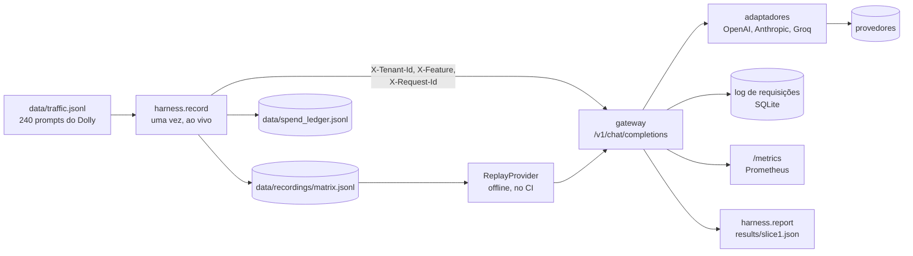

# llm-gateway

Um gateway compatível com a API da OpenAI, na frente de OpenAI, Anthropic e Groq, que atribui cada chamada a um tenant e a uma feature. Reproduzindo 240 prompts gravados por ele, o mesmo tráfego custa **US$ 0,09 por 1.000 requisições no modelo mais barato e US$ 4,21 no mais caro, uma diferença de 46 vezes**, medida offline a partir de uma única gravação ao vivo que custou US$ 1,92.

[English version](README.md)

## Resultado

Fatia 1 de 4: a espinha (API no formato da OpenAI, registro de modelos com preço, metadados obrigatórios, log de requisições, métricas). Cada um dos 240 prompts foi enviado uma vez a cada um dos seis modelos e gravado; todos os números abaixo são recalculados offline a partir dessa gravação, e o CI falha se um número publicado ficar desatualizado.

| modelo | faixa | custo por 1.000 requisições, US$ (IC 95%) | média de tokens de saída | cortadas em 1.024 tokens | latência p50, s | latência p95, s |
|---|---|---|---|---|---|---|
| gpt-6.1-sol | high | 2,12 [1,88; 2,36] | 185 | 3 de 240 | 4,7 | 16,5 |
| claude-sonnet-5-5 | high | 4,21 [3,85; 4,57] | 381 | 7 de 240 | 3,4 | 10,1 |
| claude-haiku-4-5 | medium | 1,13 [1,05; 1,21] | 197 | 0 de 240 | 2,3 | 4,7 |
| gpt-oss-120b (Groq) | medium | 0,32 [0,29; 0,35] | 483 | 62 de 240 | 1,3 | 2,9 |
| gpt-6-luna | low | 0,09 [0,08; 0,10] | 158 | 2 de 240 | 2,3 | 6,1 |
| gpt-oss-20b (Groq) | low | 0,12 [0,11; 0,13] | 357 | 18 de 240 | 0,6 | 1,7 |

O que a tabela mostra:

- **Preço por token não é custo por requisição.** O gpt-6.1-sol e o claude-sonnet-5-5 têm o mesmo preço de tabela (US$ 2 na entrada e US$ 10 na saída por milhão de tokens), mas o Sonnet custa o dobro por requisição: escreve cerca do dobro de tokens de saída (381 contra 185), e os mesmos prompts contam cerca de 50% mais tokens de entrada do lado da Anthropic (202 contra 133).
- **O limite de saída derruba modelos de dois jeitos diferentes.** O gpt-oss-120b teve 62 de 240 respostas cortadas (22 dos 30 prompts de `general_qa`) porque escreve respostas longas, muitas vezes com tabelas. As 5 respostas cortadas dos modelos GPT-6 vieram vazias: o raciocínio consumiu os 1.024 tokens inteiros, e a chamada foi cobrada mesmo assim.
- **Toda requisição é atribuída.** As 1.440 requisições reproduzidas foram registradas com tenant, feature e request id, e o custo que o gateway atribuiu por tenant soma os US$ 1,92 do registro de gastos.
- **O gateway acrescenta 0,4 ms (p50) e 0,6 ms (p95)** dentro do processo, sem contar o tempo do provedor.

O custo por classe de requisição, os intervalos e as respostas cortadas por classe estão em [results/slice1.md](results/slice1.md). A latência é o que uma máquina viu em 2026-10-07, chamando um modelo por vez; ela inclui a rede.

Se as respostas baratas são boas o bastante é a pergunta da fatia 2.

| fatia | o que acrescenta | estado |
|---|---|---|
| 1 | espinha: API, registro, metadados, log, métricas, gravação e replay | pronta |
| 2 | roteamento por custo: faixas de complexidade, mapa de faixas em YAML, paridade de qualidade verificada por juiz | próxima |
| 3 | confiabilidade: saúde por provedor, circuit breaker, failover, fila com retry, teste de caos | planejada |
| 4 | cache: exato e semântico, chave versionada, taxa de resposta errada abaixo de 1% | planejada |

Nenhum sistema em produção manda tráfego para este gateway. O tráfego é um dataset público, reproduzido.

## Caminho dos dados



As chamadas ao vivo acontecem uma vez, no `harness.record`. Tudo o que vem depois, incluindo os números publicados e a checagem do CI, reproduz a gravação pelo mesmo código do gateway, com um provedor que responde a partir do disco e recusa qualquer chamada que não tenha sido gravada.

## Decisões de design

**Gravar uma vez, reproduzir offline.** As 1.440 respostas gravadas custaram US$ 1,92 e estão commitadas. Todo experimento seguinte (políticas de roteamento, o juiz, o cache) lê essas respostas em vez de chamar um modelo, e o CI regenera o `results/slice1.json` e falha quando ele difere do arquivo commitado. Do que abri mão: a latência é um retrato único, de uma máquina num dia, então diz qual modelo estava mais lento naquela tarde, não como um provedor se comporta ao longo de uma semana.

**Adaptadores próprios sobre os SDKs oficiais, sem o LiteLLM.** Três provedores precisam de só dois formatos de API, porque o Groq fala o da OpenAI. Ter os adaptadores significa ter a taxonomia de erros (limite de requisições, timeout, conexão, erro do servidor, credencial, requisição rejeitada) que o acompanhamento de saúde da fatia 3 vai contar, e poder desligar as retentativas dos SDKs: uma retentativa escondida dentro do SDK aumentaria a latência e esconderia falhas do gateway. Do que abri mão: um quarto provedor é código novo, e o gateway não repassa streaming nem tools. Sobre "por que não o LiteLLM Proxy": o Proxy entrega o mecanismo (fallbacks, cache, orçamento); este projeto é sobre a evidência em volta dele, e o harness de gravação, replay e juiz apontaria para o Proxy do mesmo jeito.

**Um orçamento que o código impõe.** O projeto inteiro tem US$ 10. Antes de qualquer execução paga começar, o total do registro de gastos mais o pior caso da execução precisa ficar abaixo disso. O pior caso é um limite, não uma estimativa: a saída é limitada pelo teto de 1.024 tokens que a execução envia, e a entrada pelo número de bytes UTF-8 dos prompts (o dobro para a Anthropic, que não documenta seu tokenizador). Do que abri mão: o limite é folgado. Para a gravação completa ele foi de US$ 7,38 contra US$ 1,84 gastos de fato, então a checagem recusa execuções que caberiam. E o teto corta respostas longas, 92 de 1.440.

## O que não funcionou

- **A primeira fonte de tráfego.** Eu planejava reproduzir perguntas da minha própria avaliação de RAG. Eram só 69 perguntas únicas, todas da mesma classe de requisição (perguntas jurídicas sobre contexto recuperado, em português), o que não mostra diferenças entre classes. Troquei por 240 prompts do databricks-dolly-15k, 30 de cada uma das suas oito categorias.
- **A faixa barata planejada.** O plano era o Llama 3.1 8B no Groq; em 2026-10-07 ele aparecia como exclusivo do plano Enterprise. Rodá-lo localmente com o Ollama mediria a CPU do meu notebook, não um modelo servido. O gpt-oss-20b no Groq ocupou o lugar.
- **Minha estimativa de custo.** Estimei US$ 3,96 para a gravação, supondo 500 tokens de raciocínio por resposta. Custou US$ 1,92, com o smoke incluído.
- **O teto de 1.024 tokens de saída,** definido para manter o pior caso limitado. Ele cortou 26% das respostas do gpt-oss-120b e deixou cinco respostas dos GPT-6 vazias, depois que o raciocínio consumiu o limite inteiro. Mantive o teto e reporto o efeito: na fatia 2, uma resposta cortada conta como falha daquele modelo sob essa política.
- **Um timeout.** Uma chamada ao gpt-6-luna estourou os 60 s durante a gravação e foi refeita.

## Setup

Requer o [uv](https://docs.astral.sh/uv/). O Python 3.12 está fixado.

```bash
uv sync
uv run pytest                        # offline; também regenera os números publicados e compara
uv run python -m harness.report      # reescreve results/slice1.md a partir da gravação, offline
```

Para servir o gateway ou gravar novas chamadas, copie o `.env.example` para `.env` e preencha `OPENAI_API_KEY`, `ANTHROPIC_API_KEY` e `GROQ_API_KEY`.

```bash
uv run --env-file .env uvicorn llm_gateway.main:app --port 8000
curl http://localhost:8000/v1/chat/completions \
  -H "Content-Type: application/json" \
  -H "X-Tenant-Id: tenant-a" -H "X-Feature: open_qa" -H "X-Request-Id: demo-1" \
  -d '{"model": "gpt-6-luna", "messages": [{"role": "user", "content": "Name a river."}]}'
uv run --env-file .env python -m harness.record --dry-run   # plano e custo no pior caso, sem chamadas
```

Uma requisição sem os três headers é recusada com 400. `GET /v1/models` lista o registro com os preços, e `GET /metrics` serve as métricas do Prometheus.

Os prompts em `data/traffic.jsonl` derivam do databricks-dolly-15k e estão sob CC BY-SA 3.0; veja [data/README.md](data/README.md).
